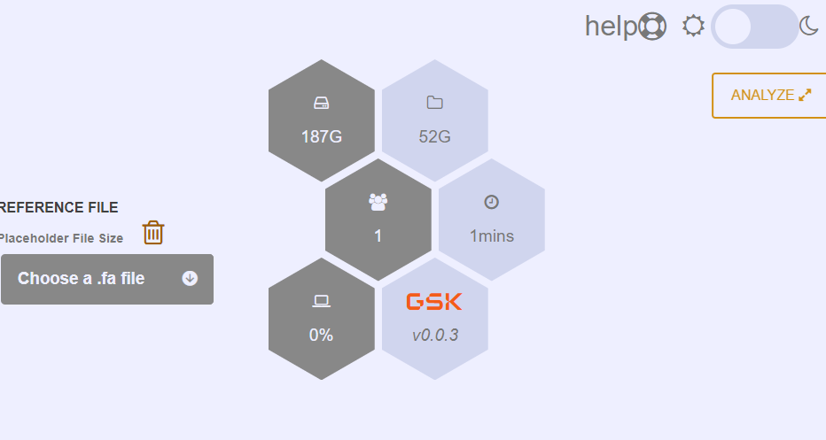
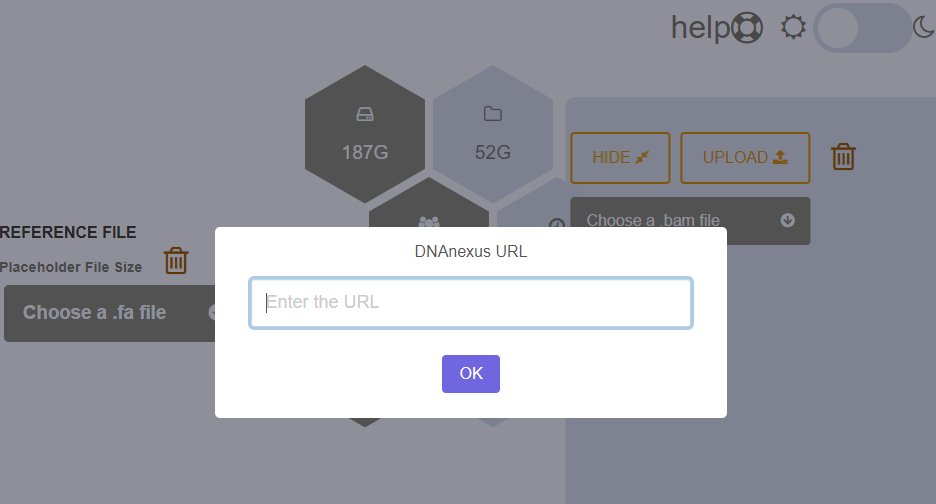
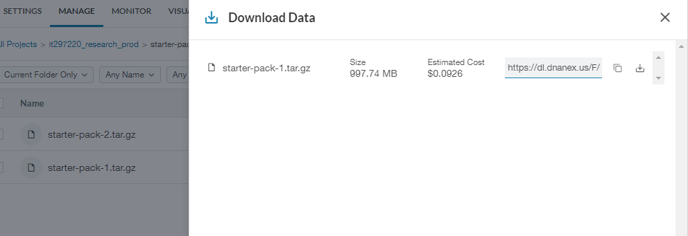
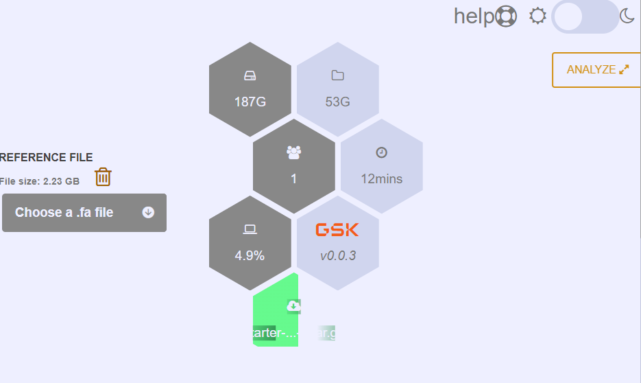
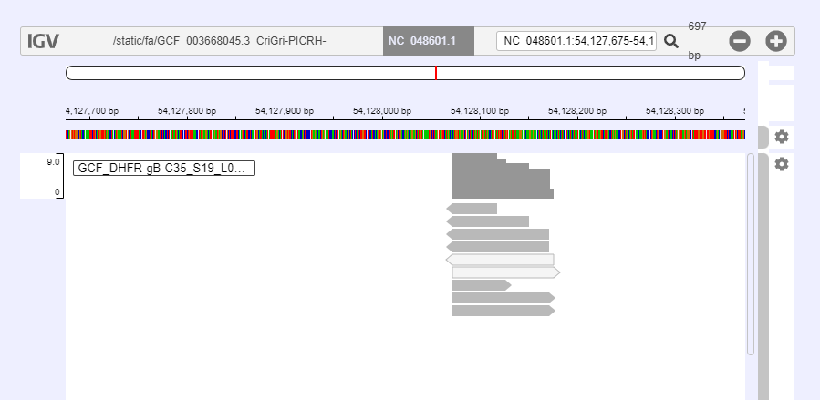
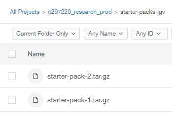

# XPRESS-BIO: lightweight + versatile Bioinformatics framework

- [XPRESS-BIO: lightweight + versatile Bioinformatics framework](#xpress-bio-lightweight--versatile-bioinformatics-framework)
  - [Motivation](#motivation)
  - [Naming Convention](#naming-convention)
  - [Quickstart](#quickstart)
  - [Using with LLMs](#using-with-llms)
  - [App structure](#app-structure)
  - [CLI arguments](#cli-arguments)
  - [Node arguments](#node-arguments)
  - [Environment Variables](#environment-variables)
  - [Configuration](#configuration)
  - [Advanced JSON Configuration](#advanced-json-configuration)
  - [Running from the container](#running-from-the-container)
  - [Route features](#route-features)
  - [Spawning workers](#spawning-workers)
  - [Security](#security)
  - [App `xpress-bio:igv-bam-NNN` showcase](#app-xpress-bioigv-bam-nnn-showcase)
    - [Building the image](#building-the-image)
      - [Running the image](#running-the-image)
    - [Running standalone](#running-standalone)
    - [Accessing DNA-Nexus](#accessing-dna-nexus)
    - [Usage](#usage)
    - [Creating Starter Packs](#creating-starter-packs)
  - [Custom 'Hello World' App](#custom-hello-world-app)
  - [Troubleshooting](#troubleshooting)
    - [Passing $PATH or other environment variables](#passing-path-or-other-environment-variables)


## Motivation

The aim of this package is to cut development time of webapps that can be deployed directly or via docker using express.js. It provides:
- rate-limiting using [`memcached`](./app/js/server/utils/loadMemcachedRoutes.js)
- configurable [`csrf`](./app/js/server/utils/loadCSRFClientSideRoutes.js) protection
- [`server-sent`](./app/js/server/utils/loadServerSent.js) events out of the box
- [`session`](./app/js/server/utils/loadSession.js) management
- [threading/`worker`](./app/js/server/workers/feed.js#L1-L20) creation

To modify server functionality or served content, change the route files inside [`app/js/server/routes`](./app/js/server/routes)

## Naming Convention

All docker-containers/packages start with `xpress-bio`. Tag name defines what the container is doing. The full names are in form of `package-name:tag-name`. For instance, the first released package is an alignment viewer using `igv.js`, so its full name is `xpress-bio:igv-bam-004`. The last 3 digits is the [`semver`](https://semver.org/) version stripped off of dot chars.

## Quickstart

From anywhere in your machine, run [`start.sh`](./app/bin/start.sh):

```shell
$ /bin/bash start.sh
```
If you are running from a docker container, do:

```shell
docker run -it --rm --name your-app-name -p 3000:3000 xpress-bio:igv-bam-004
```

If you want to run an older docker image of xpress-bio (years later when the ssl certificates expire), you can start the container with the recent certificates which it will automatically detect and install before starting the server:

```shell
docker run -it -v /your/certs/folder:/app/certs --rm --name your-app-name -p 3000:3000 xpress-bio:igv-bam-020
```

Do not change "/app/certs" if want above to work, that's the location the container will look for certs.

For all above examples, visit `localhost:3000` from your browser.

<small>
⚠️ The shell script will try to start <code>memcached</code> if not started already. Since starting services requires <code>sudo</code>, make sure you execute the commands as <code>sudo</code> if <code>memcached</code> is not running
</small>

<br>

## Using with LLMs

`XPRESS-BIO` merges `*.config.json` under `app/js/server` during runtime in memory. You can create one or any of the following:

- `apikeys.config.json`
- `apikey.config.json`
- `tokens.config.json`
- `token.config.json`
- `secrets.config.json`
- `secret.config.json`

Overlapping keys will be overwritten in the order above and merged. An example `tokens.config.json` looks like:

```json
{
    "tokens": {
        "openai": {"value": "sk-proj-rest-of-your-token-here", "endpoint": "https://api.openai.com/v1/responses"},
        "kongapi": {
            "endpoint": "https://path/to/your/companies/API/endpoint/openai/deployments/gpt-4o/chat/completions?api-version=2025-01-01-preview",
            "refresh_endpoint": "https://your-company-refresh-endpoint.com/as/token.oauth2",
            "client_id": "your-client-id",
            "client_secret": "your-client-secret",
            "grant_type": "client_credentials",
            "ttl": 1800000
        }
    }
}
```

APIs that work with `Bearer` auth scheme need `value` key like openai. Otherwise `value` is dynamically refreshed and appended at runtime for OAuth2 APIs like kongapi.

Above json example will immediately call refresh_endpoint initially and then refresh the token every 30 mins (1800000 ms = 30 min). If you omit a config file like above, you will need to enter your API key on `G-NOME` interface, which will be kept for a month. This can only be done for API endpoints that work with `Bearer` auth. You will need a config file like above for APIs that work with OAuth2 like kongapi.

`XPRESS-BIO` is context aware, for example adding keys like `refresh_endpoint` or `client_secret` to API endpoints that do not use OAuth2, like openai is silently ignored. These are internally defined (ex: `app/js/promptOAuth2.js`)

For developers, `nodemon` ignores changes to `(apikeys|apikey|tokens|token|secrets|secret).config.json` so you can remove these files without triggering a restart in a remote server after server starts. **Beware that this does not protect you from memory dump inspection if your server is compromised.**

## App structure

```js
./
└── app //main folder
    ├── bin //bash scripts
    ├── js //js files
    │   └── server //server only js
    │       ├── routes //endpoints
    │       ├── utils //middleware
    │       └── workers //web workers
    ├── src //client side
    │   └── public //0.0.0.0
    │       └── assets //folders
    └── test //unit tests
```

## CLI arguments

`XPRESS-BIO` framework depends on `npm` script to start the server, `nodemon` to watch files and restart and `node` to execute routes.

Therefore, command line arguments for [`start.sh`](./app/bin/start.sh) control parameters passed to `npm`, `nodemon` and `node`. Example:
```shell
$ /bin/bash start.sh --npm --dd -y --env <(echo "XPRESS_SECRET=mysecret") --nodemon -e js,mjs,json,txt -- --port 4000
```

Generally speaking, an argument list like:

```shell
$ start.sh --nodemon -x "ab" -y "cd" -- --port 4000 --npm --d -y --jsonconf "path/to/my-conf.json" --nodemon -y "ef"
```

is parsed like below:
- npm arguments: `--d -y`
- nodemon arguments: `-x "ab" -y "ef"`
- node arguments: `--port 4000 --jsonconf "path/to/my-conf.json"`

Parameters like `--env` require you to pass an anonymous pipe (so that values you passed are not visible if one runs `ps -aux` etc.). Therefore, if you need to execute `start.sh` as a sudoers:

```shell
$ sudo /bin/bash -c '/bin/bash start.sh --env <(echo "XPRESS_SECRET=secret1") --env <(echo "MEMSESS_SECRET=secret2")'
```

If you make `start.sh` an executable (`chmod +x start.sh`), then you can omit `bin/bash` inside the single quotes like so:

```shell
$ sudo /bin/bash -c 'start.sh --env <(echo "XPRESS_SECRET=secret1")'
```

List of available arguments:

`--npm`: Next set of args are passed to `npm`.

`--nodemon`: Next set of args are passed to `nodemon`.

`--`: Next set of args are passed to `node`.

`--env`: Create and export environment variables in the form of `KEY=VAL`

`--prod`: Set production environment for `NODE_ENV`

`--dev`: Set development environment for `NODE_ENV`. This is default.

## Node arguments

Node arguments are parameters that are passed directly to [`node`](./app/main.js). By default, arguments passed to `start.sh` are node arguments. If you used `--nodemon` or `--npm`, you can get back to initial stage by passing `--`. Rest will be parsed via [`getArgs.js`](./app/js/getArgs.js):

`--jsonconf/-j`: Pass an optional configuration option like so:

```shell
$ /bin/bash start.sh -j $(base64 -w 0 path/to/config.json)
```

The passed config must be converted to base64 format as shown above. This argument can be used with or without `server.config.json`. Check out the `Configuration` section for details.

`--fields/-f`: Dynamically pass an optional json configuration:

```shell
$ /bin/bash start.sh -f <(base64 -w 0 <(cat <<EOF
{
  "custom": {
    "a":"x",
    "d":10
  }
}
EOF
))
```

`fields` parameter [expects an anonymous pipe with base64 encoding](./app/js/slurpAnonPipeBase64toJSON.js). See the security section for further details.

`--port/-p`: Defined port number. Default is 3000.

## Environment Variables

There are 3 environment variables you can pass:
- `XPRESS_SECRET`: The secret used for encrypting sessions. There are multiple ways of passing it (assuming you converted `start.sh` in an executable):

```shell
$ sudo XPRESS_SECRET="yoursecret" /bin/bash -c 'start.sh'
```

```shell
$ start.sh --env <(echo "XPRESS_SECRET=yoursecret")
```

```shell
sudo /bin/bash -c 'start.sh --env <(echo "XPRESS_SECRET=yoursecret")' 
```

```shell
$ start.sh --env 'XPRESS_SECRET=yoursecret'
```

```shell
$ /bin/bash -c 'export XPRESS_SECRET="yoursecret"; start.sh '
```

For above to work, you first need to tell which variable to look for to `XPRESS_BIO`. This can be indicated either in:

- `server.config.json` file
- `--field` or `--conf` arguments
- `XPRESS_BIO_FIELDS` environment variable

The field key is `session["env-session-secret"]`. Check the `Configuration` section for more about this field.

The preferred ways to pass `XPRESS_SECRET` are the second and third ways, using the `<(echo "XPRESS_SECRET=yoursecret")` construct <sup>✝</sup>. This way commands like `ps -aux` will not show the secret, but a file handle like `/dev/fd/60` etc. Check the `Security` section for more info.

<small>
    ✝: If you are executing as a sudoers, passing the anonymous pipe directly without `bash -c` will not work because using `sudo` automatically closes filehandles.
</small>

<br>

- `MEMSESS_SECRET`: The secret used for `connect-memcached` session module. Similar to `XPRESS_SECRET`. The field key is `session["env-memcached-secret"]`.

- `XPRESS_BIO_FIELDS`: This is a complementary variable to define configuration:

```shell
sudo XPRESS_BIO_FIELDS="$( (cat <<EOF
{
  "session": {
    "env-session-secret":"MY_SESSION_SECRET_NAME",
    "env-memcached-secret":"MY_CACHE_SECRET_NAME"
  },
  "x-options": {
    "+rm": [
      "FAQ47368_pass_58f2b97a_2.mapped.bam",
      "FAQ47368_pass_58f2b97a_2.mapped.bam.bai"
    ]
  }
}
EOF
) | base64 -w 0)" /bin/bash start.sh --port 4000
```

This will overwrite `env-session-secret` and `env-memcached-secret` keys of `session` object within `server.config.json` and add the new object `x-options`. Similar for docker container:

```shell
docker run -it --rm --name app-test -p 4000:4000 -e XPRESS_BIO_FIELDS="$( (cat <<EOF
    {
      "x-options": {
        "+rm": [
          "my-fasta.fasta",
          "my-fai.fasta.fai",
          "my-bam.bam",
          "my-bai.bai"
        ]
      }
    }
EOF
    ) | base64 -w 0)" xpress-bio:igv-bam-004 --port 4000
```

`XPRESS_BIO_FIELDS` is a way to dynamically overwrite/modify or sometimes be used solely to define configuration options. Like `--jsonconf` option, it is in `base64` format which makes it easy to put in a `.env` file.

## Configuration

There are 4 ways to configure `XPRESS-BIO`:
- `server.config.json` file
- other `*.config.json` files next to `server.config.json`
- `--jsonconf/-j` argument to `node` 
- `--fields/-f` argument to `node`
- `XPRESS_BIO_FIELDS` environment variable

Each of these options define the final configuration. The precedence, in descending order is as follows:

`--fields/-f` > `XPRESS_BIO_FIELDS` > `--jsonconf/-j` > `*.config.json` (`b.config.json` overrides `a.config.json` for same keys) > `server.config.json`

For example: 

```shell
export XPRESS_BIO_FIELDS="$( (cat <<EOF
{
  "custom": {
    "a":1,
    "b":2
  }
}
EOF
) | base64 -w 0)"; /bin/bash start.sh --fields <(base64 -w 0 <(cat <<EOF
{
  "custom": {
    "b":3,
    "c":4
  }
}
EOF
))
```

above will log:

```shell
> },
>                       "memcached": {
>                               "ttl": 86400,
>                               "prefix": "memsess_"
>                       }
>               },
>               "custom": {
>                       "a": 1,
>                       "b": 3,
>                       "c": 4
>               }
>       },
>       "PID": 18340,
>       "PPID": 18327,
>       "workers": {}
> }
> 
```

The 4 options are recursively merged via [`parseConf.js`](./app/js/parseConf.js). Mutually exclusive fields get combined, while common fields get overwritten according to the precedence.

## Advanced JSON Configuration

The main source of configuration is [`server.config.json`](./app/js/server/server.config.json). This can serve as a static location where less frequently changed options are kept. There are 3 other ways to define configurations (see the `Configuration` section) which serve as alternative/dynamic ways to overwrite/modify the config file on the fly.

The default configuration file is in json format located inside [js/server](./app/js/server/server.config.json):

```json
{
    /*path to public folder*/
    "public": "src/public", 
    /*path to folder where static assets are served*/
    "static": "src/public/assets", 
    /*landing page*/
    "index": "static.html", 
    "port": 3000,
    /*path to folder where route files are served*/
    "routes": "js/server/routes", 
    "memcached": {
        "conf": {
            "logEvents": true
        },
        "mounts": {
            /*mount path, ex: /, /somepath*/
            "/": { 
                /*if true, mount path will be passed to RegExp*/
                "isRegExp": false, 
                /*sub routes*/
                "routes": { 
                    "/ranges\\/([A-Z0-9.\\-_]+)": {
                        "isRegExp": true,
                        "RegExpFlags": "i",
                        "limits": [
                            {
                                /*cache key to store the limit*/
                                "key": "GETLimit",
                                /*if true, all routes with same key will increment the same limit*/
                                "global": true, 
                                /*reset limit after 60 seconds*/
                                "timeout": 60, 
                                /*starting from 0, if this limit is reached via http requests, HTTP 429 status code is issued*/
                                "limit": "1000", 
                                /*Case-insensitive list of HTTP methods. Can be multiple methods separated by pipe (|) chars*/
                                "method": "GET", 
                                /*message to include  in the response body*/
                                "message": "You surpassed GETLimit", 
                                /*every request increments by 5 towards the limit*/
                                "step": 5 
                            }
                        ]
                    }
                }
            }
        }
    },
    "csrf-client-side": {
        "mounts": {
            "/": {
                "routes": {
                    ".*": {
                        "isRegExp": true,
                        "RegExpFlags": "i",
                        /*Minimum number of passes required before issuing HTTP 403 status code*/
                        "min-pass-count": 2, 
                        "message": "Your headers do not match.",
                        "method": "GET|post",
                        /*Array of header objects to validate against*/
                        "headers": [ 
                            {
                                "header": "origin",
                                "value": "https?:\\/\\/[^.]*\\.dnanexus\\.cloud|http:\\/\\/localhost",
                                "isRegExp": true,
                                "RegExpFlags": "i"
                            },
                            {
                                "header": "referer",
                                /*value can be a string, escaped regexp string or an array. If not a regexp, special char '^' can be used to indicate that the phrase must be at the beginning*/
                                "value": [ 
                                    "^http://127.0.0.1",
                                    "^http://localhost",
                                    "^undefined"
                                ],
                                "isRegExp": false
                            }
                        ]
                    }
                }
            }
        }
    },
    "server-sent": {
        "conf": {
            "logEvents": true
        },
        "mounts": {
            "/": {
                "routes": {
                    /*requests to /estream/x or /estream/y are captured. See Express's path patterns*/
                    "/estream/*": { 
                        "isRegExp": false,
                        "method": "get",
                        /*You can later use this name within routes to broadcast message to everyone using the app: serverSent.msgAll("streamOne", {payload: {...}})*/
                        "name": "streamOne", 
                        /*Retry after server connection has been lost in milliseconds*/
                        "retry": 5000 
                    }
                }
            }
        }
    },
    "session": {
        /*name of the environment variable to look for session secret. If not found or does not exist, a random hex string generated*/
        "env-session-secret": "XPRESS_SECRET",
        /*name of the environment variable to look for cache secret. If not found or does not exist, a random hex string generated*/
        "env-memcached-secret": "MEMSESS_SECRET",
        /*standard express-session config. Check https://github.com/expressjs/session for more options*/
        "session": {
            "resave": false,
            "saveUninitialized": false,
            /*default 'connect.sid'*/
            "name": "your.session.id.name",
            "cookie": {
                "maxAge": 86400000 
            }
        },
        /*Check https://github.com/balor/connect-memcached for more options*/
        "memcached":{
            "ttl": 86400,
            "prefix": "memsess_"
        }
    }
}
```

## Running from the container

The `ENDPOINT` directive in the dockerfile is `start.sh`, so starting the container is not that different from directly calling the script:

```shell
docker run --rm --name "your-app-name" -e MEMSESS_SECRET="your-secret" -e XPRESS_BIO_FIELDS="$( (cat <<EOF
    {
      "x-options": {
        "+rm": [
          "your_genomic.fasta",
          "your.fasta.fai"
        ]
      }
    }
EOF
    ) | base64 -w 0)" -p 3000:3000 xpress-bio:igv-bam-004 -j $(base64 -w 0 path/to/config.json) 
```
Above passes environment variables using the `-e` option of docker. It uses `XPRESS_BIO_FIELDS` env variable and `-j` option to pass a custom object to merge with the default `server.config.json`. The same object can be passed using the `--env-file` directive of docker:

```shell
echo "XPRESS_BIO_FIELDS=$( (cat <<EOF
    {
      "x-options": {
        "+rm": [
          "your_genomic.fasta",
          "your.fasta.fai"
        ]
      }
    }
EOF
    ) | base64 -w 0)" >> sample.env.file && echo "MEMSESS_SECRET=your-secret" >> sample.env.file
```

Contents of `sample.env.file`:

```shell
XPRESS_BIO_FIELDS=ICAgIHsKICA...
MEMSESS_SECRET=your-secret
```

And then you can pass it to `docker` like so:

```shell
docker run --rm --name "your-app-name" --env-file sample.env.file ...
```

## Route features

When you create new routes inside [`server/routes`](app/js/server/routes/), wrap and export them like so:

```js
module.exports = function({express, app, info, files, serverSent}){
    //your code goes here
}
```
Your routes are called once the main scripts complete their executions:
> [main.js](./app/main.js) -> [express.js](./app/js/server/express.js) -> [loadUserRoutes.js](./app/js/server/utils/loadUserRoutes.js) -> *your route files*

This allows your route functions to utilize in-built nifty variables:

- `express`: [the express constructor](./app/js/server/express.js)
- `app`: [the express app](./app/js/server/express.js)
- `info`: An object with details about your app and environment. It is created by [getInfo.js](./app/js/getInfo.js) and printed to terminal during server start by [main.js](./app/main.js):
```js
log(
	"Here are your parameters:",
	JSON.stringify(info,null,"\t")
);
```

Here is what it looks like:

```
˅˅˅˅˅˅˅˅˅˅˅˅˅˅˅˅˅˅˅˅˅˅˅˅˅˅˅˅˅˅˅˅˅˅˅˅˅˅˅˅˅˅˅˅˅˅˅˅˅˅˅˅˅˅˅˅˅˅˅˅˅˅˅˅˅˅˅˅˅˅˅˅˅˅˅˅˅˅˅˅
> Here are your parameters:
> {
>       "version": "0.1.2",
>       "environment": "development",
>       "rootFolder": "path/to/app",
>       "nodeBinaries": "path/to/app/node_modules/.bin",
>       "dockerBinaries": "path/to/app/bin",
>       "nodaemon": true,
>       "input": "/app/mount/config.json",
>       "isContainer": "0",
>       "serverConf": {
>               "public": "src/public",
>               "static": "src/public/assets",
>               "index": "static.html",
>               "port": "3000",
>               "routes": "js/server/routes",
>               "memcached": {
...
```

- `files`: A files object that created by [getFiles.js](./app/js/getFiles.js). The contents are also briefly logged at server start:

```

> ˅˅˅˅˅˅˅˅˅˅˅˅˅˅˅˅˅˅˅˅˅˅˅˅˅˅˅˅˅˅˅˅˅˅˅˅˅˅˅˅˅˅˅˅˅˅˅˅˅˅˅˅˅˅˅˅˅˅˅˅˅˅˅˅˅˅˅˅˅˅˅˅˅˅˅˅˅˅˅˅
> Requestable files:
> {
>       "static.html": "path/to/app/src/public/static.html",
>       "animate.css": "path/to/app/src/public/assets/css/animate.css",
>       "delete-icon.css": "path/to/app/src/public/assets/css/delete-icon.css",
>       "fontawesome.css": "path/to/app/src/public/assets/css/fontawesome.css",
>       "help.css": "path/to/app/src/public/assets/css/help.css",
>       "hexgrid.css": "path/to/app/src/public/assets/css/hexgrid.css",
>       "main.css": "path/to/app/src/public/assets/css/main.css",
...
```
All files under [public](./app/src/public/) are listed. In the future, it might be useful to convert this object into a `proxy` of an `object` where the keys are absolute paths but not basenames. This way, the proxy would return based on matching score and prevent name collisions inside nested folders. Check the `TODO` section.

- `serverSent`: This is an object created by [loadServerSent.js](./app/js/server/utils/loadServerSent.js). It allows you to establish live server-to-one / server-to-many communication. In your `server.config.json`, first create a channel to subscribe:

```
"server-sent": {
        "mounts": {
            "/x": {
                "routes": {
                    "/y/*": {
                        "name": "streamXY",
                        "retry": 5000
                    }
                }
            }
        }
    },
```

Now in your front-end application, you can do:

```js
const evtSource = new EventSource('/x/y/any-string');
```

This creates an [`EventSource`](https://developer.mozilla.org/en-US/docs/Web/API/EventSource), it allows you to [subscribe](https://developer.mozilla.org/en-US/docs/Web/API/Server-sent_events/Using_server-sent_events) to events:

```js
evtSource.addEventListener("message", function(e){
    const oPayload = JSON.parse(e.data);
    //your code goes here            
});
```

or [specific events](https://developer.mozilla.org/en-US/docs/Web/API/Server-sent_events/Using_server-sent_events):

```js
evtSource.addEventListener("my-event", function(e){
    const oPayload = JSON.parse(e.data);
    //your code goes here            
});
```

On your server side route, you send generic events (that fire `onmessage`) like so:

```js
serverSent.msgAll("streamXY",{payload: {a:"john", b:"doe"}});
```

[`serverSent.msgAll`](./app/js/server/utils/loadServerSent.js) method expects a channel name (`streamXY` in this example) and a payload (`string` or `json`). You can also send specific events like so:

```js
serverSent
    .msgAll("streamXY",{directive: "event", payload: "your-event"})
    .msgAll("streamXY",{payload: {a:"john", b:"doe"}})
```

Sending the special `{directive: "event", payload: "your-event"}` tells `ServerSent` instance that the next payload will trigger `your-event` on the front-end application.

`serverSent.msgAll` sends a message to everyone connected to your app. Send a message to a single user like so:

```js
module.exports = function({express, app, info, files, serverSent}){
    app
    .get('/x/y/any-string', function(req, res, next) {
        serverSent
            .msg("streamXY", req.session.id,  {directive: "event", payload: "your-event"})
            .msg("streamXY", req.session.id, {payload})
    })
}
```
Above snippet will fire `your-event` on client side with `event.data` being `payload`.

Behind the scenes, `serverSent` is `proxy` interface that stores `request` and `response` information. For instance, if you call: 

```js
serverSent.get("streamXY", req.session.id)
```

it will return useful information you can later use with downstream [express middleware](https://expressjs.com/en/guide/using-middleware.html#middleware.router):

```json
{
    response //response object
    timeout //if maxAge option is set, the timeoutID
    createdAt //since Unix epoch
    sessid //session id
    destroy //method to remove this user
    name //channel name
    nMap //all other members in the channel
}
```

There are many other methods [`serverSent` exposes](./app/js/server/utils/loadServerSent.js) which you can use inside your route files.

## Spawning workers

[Workers](https://nodejs.org/docs/latest-v16.x/api/worker_threads.html) are individual threads that share the same process id. They are not individual processes, but they can remove a lot of load from the main thread. To create a worker, you need two files:

- A [route](./app/js/server/routes/) that harbors a worker instance (created via `new Worker`) which will pass/receive data to the worker thread
- A [worker](./app/js/server/workers/) that will receive data from the route worker instance and send a message back.

An example route file looks like:

```js
const {Worker} = require("node:worker_threads"),
      {until} = require("../../helpers.js"),
      path = require('path'),
      portKey = Symbol.for("customPort");
      
module.exports = function({express, app, info, files, serverSent}){
    const worker = new Worker(
        path.resolve(__dirname,"../workers/your-worker.js"), 
        {
            workerData: {
                //pass your data to worker
            }
        }
    );
    until(() => worker[portKey])
    .then(port => {
        /* ########################
        ######YOUR CODE BELOW######
        ######################## */
        //receive message from worker
        port.on("message", function(message){
            //do something with the message
        });
        //send message to the worker
        port.postMessage({/*your message object*/})
    });
}
```

When a worker is created using `new Worker`, like above, [registerWorker.js](./app/js/registerWorker.js) gets called due to [main.js](./app/main.js) attaching `worker` event on `process`. It does a couple of things:

- Creates a `customPort` `Symbol` to use as key and value as `port` on the `Worker` instance. This minimizes name collisions.
- Creates a `MessageChannel` and passes one of the ports to the worker thread via `postMessage`

In the above snippet, `until` is a helper function to wait while `customPort` `symbol` is ready on the worker instance. 

On the worker thread side:

```js
const {workerData, parentPort} = require("node:worker_threads"),
      {log, until} = require("../../helpers.js");

(new Promise(res => {
    parentPort.once("message", function(message){
        /*
            process.pid of the parent is exactly the same here.
            so process refers to the parent, NOT the worker
        */
        let {port, threadId} = message;
        port.on("close",function(){
            log(
                `Worker port-2 closing`,
                `{threadId: ${threadId}}`
            );
        });
        res(port);
    });
})).then(port => {
    /* ############################
    ######WORKER CODE HERE######
    ############################ */
});
```

The thread will wait until it receives the `port` via message and then you can execute your code with the `workerData` etc. When you want to send something back to the worker instance, do:

```js
port.postMessage({/*your message*/});
```

## Security

Certain arguments such as:

- `--env`
- `--fields`

accept anonymous pipes created via [process substitution](https://www.gnu.org/software/bash/manual/html_node/Process-Substitution.html). These constructs return an anonymous filehandles such as `/dev/fd/62` etc. which makes their contents opaque if a user decides to run `ps -aux`. However, this is **NOT** a bullet proof solution.

Unless commands like `stty -echo` or `set +o history` take care of logging, these commands can still be visible. Besides, other users who are in the group `docker` can invoke [`docker inspect`](https://docs.docker.com/engine/reference/commandline/inspect/) command to peek into the values of these variables.

Docker has a service called `Docker Secrets`, but it requires setting up [docker swarm](https://docs.docker.com/engine/swarm/secrets/). So use the environment variables and the anonymous pipes knowing that if your host machine is compromised, these remedies will not help much.

## App `xpress-bio:igv-bam-NNN` showcase

This section will demonstrate some of the features of the `xpress-bio:igv-bam-004` docker image.
### Building the image

Navigate to `../app` and run:

```shell
docker build --no-cache -t xpress-bio:igv-bam-004 .
```

After building and getting an exit code of 0, verify that you have the image:

```shell
docker image list
```
#### Running the image

```shell
docker run -it --rm --name app-test -p 3000:3000 xpress-bio:igv-bam-004
```

Visit `localhost:3000` from your browser.

### Running standalone

Navigate to [app/bin](./app/bin/) and run:

```shell
/bin/bash start.sh
```

Visit `localhost:3000` from your browser. To stop the server, go back to the terminal and hit `Ctrl + C` on Windows or `Cmd + .` on Mac.

### Accessing DNA-Nexus

[DNA Nexus](https://dnanexus.gsk.com/) is a platform where you can store large genomic sequences, transfer them between clients and run docker containers behind an `nginx` proxy. This makes it easy to move files back and forth between applications and also takes care of user `authentication`, as well as `https`. Some of the features demonstrated requires you to have an [account](https://dnanexus.gsk.com/).

### Usage

You can either:
- start the app directly on your local environment and visit `localhost:3000`
- start the app as a docker container: `
docker run -it --rm -p 3000:3000 xpress-bio:igv-bam-004
`
- start a container instance on `DNA Nexus`.

Rest of the section will assume you are starting a container instance on `DNA Nexus`.
Once you logged in, go the the folder where the app is installed, click on the app icon and start the container, it will take around 5 mins for `DNS` records to start taking effect. Click the link once it is generated, the app should look like below:



Right now the `Reference File` dropdown where it says `Choose a .fa file` is empty because we do not yet have any datasets. Click on the `ANALYZE` button on the far right edge to expand additional settings and click `UPLOAD`:



The app only allows [`DNA Nexus` links to be posted](./app/js/server/workers/dl.js). If you have access to `***_research_prod` folder (you can request access from *Ibrahim Tanyalcin*), you will find `starter-packs-igv` folder. Otherwise go to your `DNA Nexus` project folder and generate a download link:



To understand what these links are for, take a look at the next section *Creating Starter Packs*. Copy the link and paste it in the input box, click `OK`. This will start a download of the `tarball` and you will see a new hexagon icon as download progresses:



Once the download is finished, the dropdown menu on the left, and the inside the `ANALYZE` side panel will be updated. Do not forget that, other users of the app will also receive the updated file list! Click `ANALYZE` again, and select the bam file from the dropdown and click `VISUALIZE`. *IGV* will start shortly:



To remove *.bam* or *.fa* files, click on the trash bin icons next to the dropdowns. Do not forget that removing files also remove for other users of your app!

In certain cases, it might be desirable to disable deletion of certain files. In fact, the docker container achieves this by [passing explicit filenames at runtime](../../src/docker-web-app.sh) (you can also pass a regular expression string, which later will be parsed by your routing logic), using the `XPRESS_BIO_FIELDS` environment variable:

```shell
(docker run --rm --name "${appName}" -e XPRESS_BIO_FIELDS="$( (cat <<EOF
    {
      "x-options": {
        "+rm": [
          "GCF_003668045.3_CriGri-PICRH-1.0_genomic.fasta",
          "GCF_003668045.3_CriGri-PICRH-1.0_genomic.fasta.fai",
```

and later in the app route for deletion, it is checked against this array:

```js
let fName = path.basename(sanitizeFilename(req.params.fName)),
            fileName = path.resolve(dir, fName);
/*if in the initial files object when the container started OR in the array specified by x-options, decline deleting*/
if (
    files[fName] 
    || ~(
        info
        .serverConf
        ?.["x-options"]
        ?.["+rm"]
        ?.indexOf(fName) ?? -1
    )
) {
    next({
        fileType,
        fileName: fName,
        message: "You cannot delete initial datasets."
    });
    return
}
```
### Creating Starter Packs

Provided that the uploaded links are from *DNA Nexus*, the application has the ability to automatically extract `tar.gz`, `lz4` etc. compressed archives, pick the relevant files and place them in right folders and automatically inform/update all users of the app, **live**. Providing archive files instead of regular files allows one to upload many files at once. You can easily create such bundles to make easier to move files into your container. An example of such bundles are the [`starter packs`](***), these packs include an entire bundle of relevant fasta, fai, bam, bai files to populate the drop down menus for you:



To create a starter pack:

```shell
tar -czvf your-starter-pack.tar.gz ./*
```

Above will create `starter-pack-2.tar.gz` in the current working directory (`cwd`) from all the files. Do not worry if some file extensions are not supported, these files will be [ignored](./app/bin/downloadX.sh).

To list the contents for the archive you created:

```shell
tar -tvf your-starter-pack.tar.gz
```

Finally upload these to the *DNA Nexus* cloud to make it available to your container(s) and everyone else:

```shell
dx upload your-starter-pack.tar.gz
```

<small>
Note that you first need to install `dx`, have a *DNA Nexus* account and a generated token, and login to the account using `dx login --token your-token`
</small>

<br>

## Custom 'Hello World' App

- Empty the `app/js/server/routes` folder
- Create a `hello-world.html` file and place it anywhere inside `src/public`. Files inside this folder are [indexed and passed](./app/js/getFiles.js) as `files` object where each key is the `basename` of the file and values are the absolute path.
- Create a static route called `my-route.js`:

```js
module.exports = function({express, app, info, files, serverSent}){
    app.get('/', function (req, res, next) {
        res.sendFile(files["hello-world.html"]);
    });
}
```

- If you change `server.config.json` and set `index` field to `hello-world.html`, then you could do: `res.sendFile(files[info.serverConf.index])` instead of `res.sendFile(files["hello-world.html"])`
- Keep in mind that `express, app, info, files, serverSent` objects are always passed to your routes fully initialized before your routes are executed. Check the `Route features` section to learn more about these objects.

## Troubleshooting

### Passing $PATH or other environment variables

You might wonder why the command below would not work:

```shell
sudo /bin/bash -c '/bin/bash start.sh --fields <((cat <<EOF
{"executables": {
  "samtools": ["/home/some-user/.local/bin/samtools-1.18", "some/other/path"]
}}
EOF
) | base64 -w 0)'
```

Above command tries to add an extra field 'executables' to server configuration via the `--fields` argument which allows `xpress-bio` to call `samtools` binary. Here `sudo` creates an additional context that causes the anonymous pipe to be closed or not give correct permissions to child processes even though they are spawned as `root`. Here are some alternatives:

**Use a named FIFO:**
```shell
mkfifo /tmp/myfifo
echo -n "{\"executables\": {\"samtools\": [\"/home/some-user/.local/bin/samtools-1.8\", \"some/other/path\"]}}" | base64 -w 0 > /tmp/myfifo &
sudo bash -c '/bin/bash start.sh --fields /tmp/myfifo'
rm /tmp/myfifo
```
<small>Do not use above for sensitive data as the information that is passed can be observed by others.</small>

**Use the --env option:**

Modify the current path or any env var as you see fit and then:

```shell

sudo /bin/bash -c "/bin/bash start.sh --env  <(echo \"PATH=$PATH\")"
```

This is the recommended way

**Use the XPRESS-BIO-FIELDS env var:**
```shell
sudo XPRESS_BIO_FIELDS="$( (cat <<EOF
{
  "executables": {
    "samtools": ["/some/path", "/home/some-user/.local/bin/samtools-1.18"]
  }
}
EOF
) | base64 -w 0)" /bin/bash -c "/bin/bash start.sh"
```

<small>Do not use above for sensitive data as the information that is passed can be observed by others.</small>

**Use the -j option:**
```shell
sudo /bin/bash -c '/bin/bash start.sh -j $( (cat <<EOF
{"executables": {
  "samtools": ["/home/some-user/.local/bin/samtools-1.18", "some/path"]
}}
EOF
) | base64 -w 0)'
```

<small>Do not use above for sensitive data as the information that is passed can be observed by others.</small>

**Use the cascading configs feature:**

Create a file called `custom.config.json`
```json
{
    "executables": {
        "samtools": [
            "/home/some-user/.local/bin/samtools-1.18",
            "/some/other/path"
        ]
    }
}
```

Save it inside `app/js/server/`, next to `server.config.json`. Any json file under this path that ends with `*.config.json` will not be committed to git repos or docker builds but can be thought of an additional layer that gets alphabetically sorted and merged with `server.config.json` at runtime (`b.config.json` overrides `a.config.json` for same keys). For docker images, you can first execute `docker cp` to copy the custom configuration file and then start the server.
